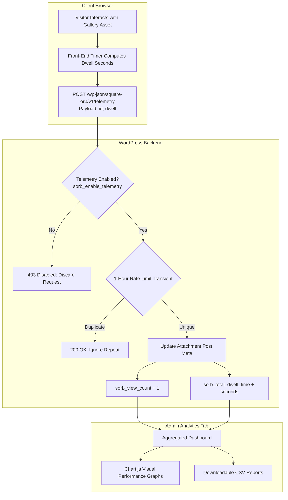

Square Orb includes a self-hosted, privacy-first engagement tracking engine that helps photographers and creators understand which portfolio assets resonate most with visitors.

---

### Activating the Analytics Tab

To protect user privacy and optimize server resources, **Square Orb's telemetry engine is disabled by default**, and the **Analytics** tab is hidden from the admin navigation menu.

To activate analytics:
1. Go to **Square Orb > Global**.
2. Scroll to the **Analytics & Telemetry** section.
3. Toggle on **Enable Engagement Telemetry**.
4. Click **Save Changes**.
5. The **Analytics** tab will now appear in the admin navigation bar.

---

### Privacy-First Architecture

Square Orb is engineered with strict privacy standards:
- **100% Self-Hosted:** All telemetry is captured and stored directly in your local WordPress database. No data is ever transmitted to external servers, cloud services, or third-party tracking APIs.
- **Zero Personally Identifiable Information (PII):** The tracking engine does not log IP addresses, browser fingerprints, user agent strings, or cookie identifiers.
- **GDPR & CCPA Compliant:** Because metrics are aggregated purely per asset ID without user identification, no consent banner or cookie disclaimer is required for Square Orb's telemetry.
- **Locally Bundled Visualizations:** The charts are rendered using a locally bundled copy of Chart.js—no external CDN connections are established.

---

### Key Engagement Metrics

The Analytics dashboard provides deep visibility into asset interaction:

| Metric | Measurement Unit | Description |
| :--- | :--- | :--- |
| **Total Views** | Count | Incremented when an asset is rendered in the active gallery viewport or opened in the Lightbox. |
| **Total Dwell Time** | Seconds | High-precision measurement of how long an asset remains actively displayed on the viewer's screen or in the lightbox. |
| **Engagement Rate** | Ratio | Average dwell time per view, highlighting which photographs captivate visitors longest. |

The dashboard displays top-performing assets in interactive visual charts alongside a sorted tabular breakdown.

---

### Exporting & Managing Telemetry Data

Square Orb provides built-in tools for reporting and data hygiene:

- **Export CSV:** Click the **Export Telemetry CSV** button at the top of the Analytics tab to download a raw CSV export of all asset performance metrics for external analysis in Excel, Numbers, or Google Sheets.
- **Reset Telemetry Data:** If you are redesigning your portfolio or want to start a fresh measurement period, you can purge all historical telemetry records with a single click.
- **Clean Uninstall:** When the Square Orb plugin is uninstalled via WordPress Admin, all telemetry options and stored metrics are automatically purged from your database.
