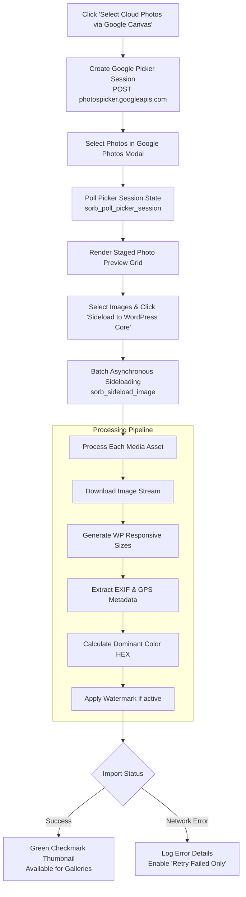

import { Steps } from '@astrojs/starlight/components';

Once your Google account is authenticated on the Authentication tab, use the **Import Media** tab to sideload assets directly into your WordPress Media Library.

---

### Import Lifecycle & Pipeline

---

### Step-by-Step Import Instructions

<Steps>

1. Navigate to **Square Orb > Import Media** in your WordPress admin menu.

2. Click **Select Cloud Photos via Google Canvas**.

3. In the Google Photos Picker popup window, browse your Google Photos library, check the items you wish to import, and click **Done**.

4. The selected items will load into the admin **Photo Grid** as staged previews. By default, all newly chosen items are highlighted in green. Click any thumbnail to toggle its selection status.

5. Click **Sideload to WordPress Core (X)** (where X is the number of selected assets).

6. Square Orb streams the images to your server, generates standard WordPress image sizes, extracts EXIF/GPS metadata, calculates dominant color hex codes, applies watermarks (if enabled), and attaches them to your WordPress Media Library.

7. When the batch completes:
   - Successfully imported items display a green checkmark thumbnail.
   - If network interruptions occur, an expandable error log reveals the exact error message. Click **Retry failed only** to reprocess only the failed items without duplicating successful ones.
   - Click **View imported media** to jump straight to your WordPress Media Library.

</Steps>

*Note on Adobe Lightroom CC: Account authentication is currently supported on the Authentication tab. Direct cloud photo browsing and sideloading for Lightroom CC assets is scheduled for the upcoming v1.2 release.*