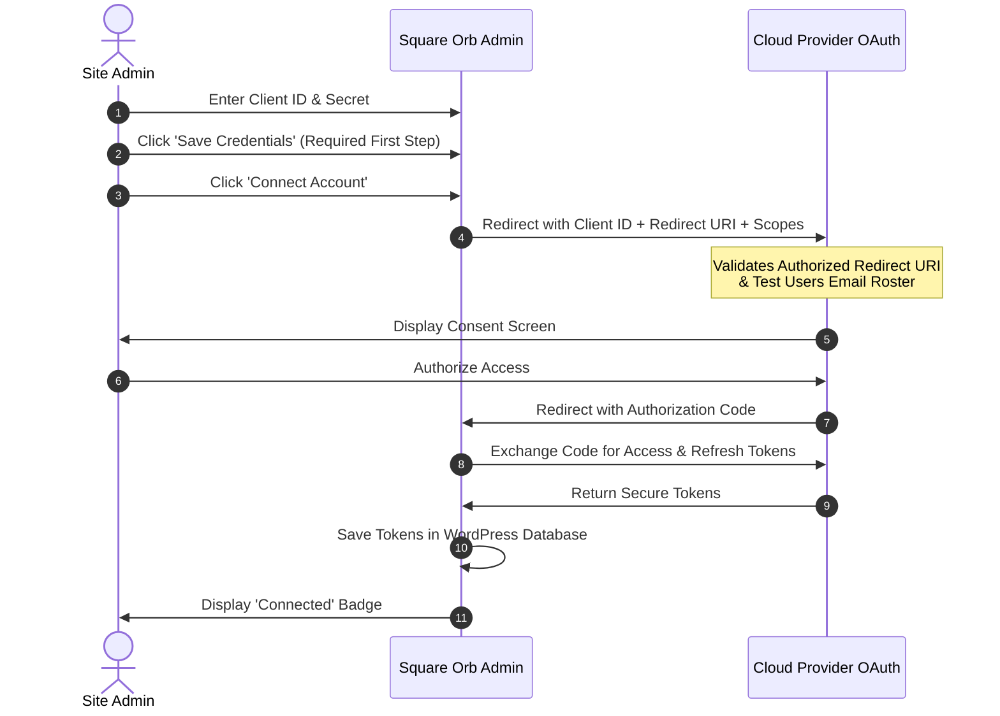

import { Steps } from '@astrojs/starlight/components';

To set up your cloud connections:

<Steps>

1. Navigate to **Square Orb > Authentication** in your WordPress admin menu.

2. **Google Photos:** Enter your **Google OAuth Client ID** and **Google OAuth Client Secret**, click **Save Google Credentials**, and then click **Connect to Google Photos** to authorize your account.

3. **Google Vision API:** Optionally enter a Google Cloud Vision API key for experimental AI label detection and auto-tagging. Click **Save Google Credentials**.

4. **Adobe Creative Cloud (Lightroom):** Enter your **Adobe Client ID** and **Adobe Client Secret**, click **Save Adobe Credentials**, and then click **Connect to Lightroom** to establish the OAuth connection. *(Note: Photo browsing and import UI via Lightroom is in active development for v1.2).*

</Steps>

---

### OAuth 2.0 Authentication Flow

---

### Key Concepts to Remember

- **Authorized Redirect URI:** Both Google Cloud Console and Adobe Developer Console require an "Authorized Redirect URI." You must copy the exact URL displayed on your WordPress **Square Orb > Authentication** tab (e.g., `https://yourdomain.com/wp-admin/admin.php?page=square-orb`) and paste it into the respective developer console.
- **Save Before Connecting:** Always click the **Save Credentials** button before clicking the "Connect" button. The connection handshake requires the credentials to be saved in your WordPress database first.
- **Security:** Never share your Client Secret or Vision API Key publicly.
- **Billing & Quotas:** Google Photos Picker API and Adobe Developer APIs offer free tiers for personal website usage, but require projects to comply with respective developer terms of service.
