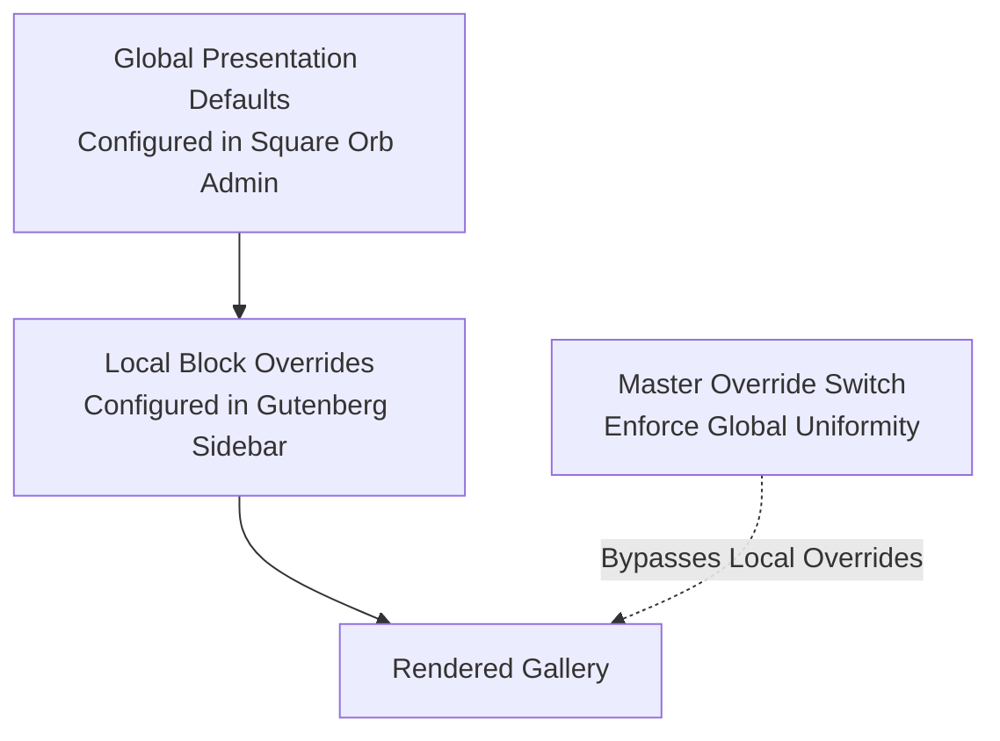

Square Orb provides a flexible two-tier configuration system that balances brand-wide design uniformity with page-by-page creative freedom.

---

## The Configuration Hierarchy

Square Orb resolves gallery styling through a three-level priority structure:

---

### 1. Global Presentation Defaults (Baseline)

Configured under **Square Orb > Presentation Defaults** in your WordPress admin dashboard. These settings dictate how any newly placed gallery block looks and behaves by default, including:

* Gallery layout (Grid, Masonry, Justified, Carousel, Map)
* Column counts and grid spacing
* Heading tags and typography sources
* Lightbox overlay color, border framing, and animation transitions
* Pagination buttons and colors

### 2. Local Canvas Overrides (Per-Block Customization)

When editing a specific page or post in Gutenberg, you can adjust settings directly in the **Square Orb Canvas** block sidebar. 

* **Visual Indicator:** Any setting altered from the global default displays a `(Local Override)` tag next to its label in the block editor. Settings mirroring global defaults display `(Global Default)`.
* **Individual Flexibility:** This allows a photography portfolio to feature a dynamic masonry layout on one page, a touch carousel on a product page, and an interactive map on a travel post.

### 3. The Master Override Switch (Global Enforcement)

Located at the top of the **Presentation Defaults** tab under **Master Override Switch**:

* **When Enabled:** Enforces site-wide uniformity by forcing every gallery container on your site to inherit the central Global Presentation Defaults, ignoring all local block style overrides.
* **Editor Notice:** In Gutenberg, the block settings sidebar displays a **"Master Lock Override Active"** notification, preventing conflicting style modifications.
* **Content Exception:** Content-level attributes—namely your selected media images, video URLs, and custom **Heading Text**—remain completely independent per block and are never locked out.

---

## Resetting Block Overrides

If you have customized a gallery block locally and want to return it to the current site-wide defaults:

1. Select the **Square Orb Canvas** block in the WordPress editor.
2. Scroll to the **Reset Options** panel in the block settings sidebar.
3. Click **Clear Canvas Overrides**.
4. All local style attributes will be cleared, immediately restoring global inheritance.
