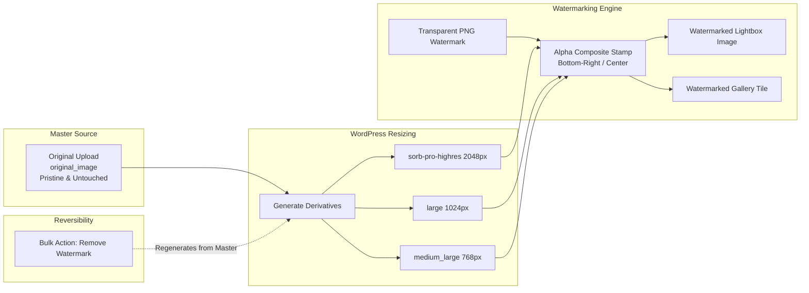

Square Orb provides an integrated, non-destructive watermarking engine to safeguard your photography from unauthorized redistribution while keeping your master originals completely pristine.

---

### Non-Destructive Architecture

Many traditional watermarking tools permanently overwrite your original uploaded files, making it impossible to remove or reposition a watermark later without re-uploading every photo from scratch.

Square Orb's watermarking engine works differently:
- **Untouched Master Files:** Your original high-resolution master uploads (`original_image`) are never modified or stamped.
- **Intermediate Size Stamping:** Watermarks are only composited onto the web-delivery image sizes generated by WordPress (e.g., `large`, `medium_large`, and Square Orb's `sorb-pro-highres` Lightbox size).
- **Reversible at Any Time:** Because original master files remain untouched in your `wp-content/uploads/` directory, watermarks can be updated, repositioned, or completely removed at any time using built-in bulk actions.

---

### Setting Up Global Watermarking

Navigate to **Square Orb > Global** in your WordPress dashboard and locate the **Watermark Protection** card:

1. **Watermark Overlay (PNG):**
   - Click **Select PNG Watermark** to launch the WordPress media uploader.
   - Choose or upload your watermark logo. For best results, use a transparent PNG-24 with clean alpha transparency.
2. **Watermark Position:**
   - **Bottom Right:** Places the watermark subtly in the bottom-right corner of each photograph, ideal for creator signatures and subtle branding.
   - **Center:** Stamps the watermark across the focal center of each image, ideal for commercial proofs and draft review galleries.
3. **Auto-Watermark Native Uploads:**
   - Toggle this option to **ON** if you want every new image uploaded through the standard WordPress Media Uploader or Cloud Importer to be automatically stamped upon arrival.
4. Click **Save Changes**.

---

### Bulk Watermarking Existing Media

If you already have images in your WordPress Media Library that were uploaded before watermarking was configured:

1. In the WordPress admin menu, navigate to **Media > Library**.
2. Switch to the **List View** (the icon with horizontal lines in the upper-left of the media library table).
3. Use the checkboxes to select the images you wish to stamp.
4. Open the **Bulk actions** dropdown menu at the top of the table.
5. Select **Apply Square Orb Watermark** and click **Apply**.

Square Orb will batch-process the selected media, applying your active watermark PNG to their web-ready derivatives.

---

### Removing Watermarks

If you ever change your brand logo, decide to remove watermarks, or want to reposition your watermark:

1. Navigate to **Media > Library** in List View.
2. Select the images with existing watermarks.
3. In the **Bulk actions** dropdown, select **Remove Square Orb Watermark** and click **Apply**.
4. Square Orb regenerates all intermediate image sizes directly from your untainted master originals, completely stripping the watermark stamp.

---

### Best Practices for Watermark Assets

- **File Format:** Always use **PNG-24** with an alpha transparency layer. Do not use JPEG or GIF formats, as they do not support smooth translucent anti-aliasing.
- **Resolution:** Design your watermark canvas at approximately 800 × 400 pixels or smaller. Square Orb automatically scales the watermark proportionally relative to the target image dimensions so it never overwhelms smaller thumbnail previews.
- **Color & Contrast:** Use semi-transparent white (60%–80% opacity) with a subtle drop shadow. This ensures your watermark remains clearly legible against both bright highlights and dark shadows.

